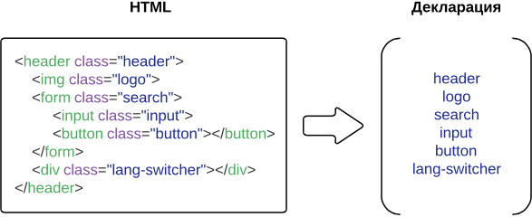
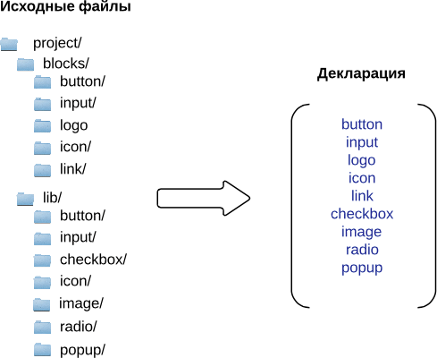

# Декларации в БЭМ

Чтобы собрать только необходимые БЭМ-сущности для постороения страницы (читай «частного случая [бандла](../build-method/build-method.ru.md#bundle)»), можно воспользоваться **декларацией**.

Декларация представляет собой список [блоков](../definitions/definitions.ru.md#Блок), [элементов](../definitions/definitions.ru.md#Элемент) и [модификаторов](../definitions/definitions.ru.md#Модификатор), которые используются на странице. Таким образом, декларация ограничивает количество сущностей, попадающих в сборку. Нет необходимости подключать все блоки проекта, если можно собрать только нужные по списку.

Существуют различные [способы построения декларации](#Способы-получения-декларации).

Задача декларации определить, что и в каком порядке подключать в сборку.

>В БЭМ-платформе описание страницы создается в формате BEMJSON, а декларация страницы описывается в формате BEMDECL, например:
```js
exports.blocks = [
    { name: 'input' },
    { name: 'button' },
    { name: 'checkbox' }
];
```

## Способы получения декларации

Декларация может формироваться вручную (для этого нужно перечислить БЭМ-сущности, необходимые для построения страницы) или строиться автоматически:

* [по описанию страницы](#Создание-декларации-по-описанию-страницы)
* [с помощью интроспекции файловой системы](#Создание-декларации-с-помощью-интроспекции-файловой-системы)

### Создание декларации по описанию страницы

В БЭМ-проекте структура страницы описывается с помощью [БЭМ-дерева](../definitions/definitions.ru.md#БЭМ-дерево). HTML страницы содержит классы с именами всех используемых блоков, элементов и модификаторов. БЭМ-дерево может быть построено автоматически по классам из HTML-файла или создано вручную.

При сборке страницы декларация формируется автоматически на основании данных из БЭМ-дерева: все сущности (блоки, элементы и модификаторы) попадают в декларацию в требуемом порядке, без повторений и отображения вложенности. Результатом сборки являются, например, CSS- и JavaScript-файлы для этой страницы.

>Один из инструментов, позволяющих получить БЭМ-дерево по HTML-структуре страницы — [html2bemjson](https://github.com/bem-incubator/html2bemjson).



>Пример проекта, в котором формируется отдельная декларация для каждой страницы — [Создаем свой проект на БЭМ](https://ru.bem.info/tutorials/start-with-project-stub/).

### Создание декларации с помощью интроспекции файловой системы

При сборке в декларацию автоматически попадают все БЭМ-сущности, находящиеся в файловой системе проекта со всех уровней переопределения.



>В [bem-components](https://ru.bem.info/libs/bem-components/) такой способ создания декларации используется для поставки библиотеки в виде [Dist](https://ru.bem.info/libs/bem-components/current/#Варианты-поставки-библиотеки).

## Способы управления декларациями

С помощью деклараций можно управлять набором сущностей, попадающих в сборку. Декларации можно совмещать, повторно использовать, выделять общие части или различия. Такое управление дает возможность собирать все страницы в один [бандл](../build-method/build-method.ru.md#bundle), догружать необходимые части страницы по требованию, повторно использовать уже собранные общие компоненты на разных страницах и не только.

Возможные действия с декларациями:

* [сложение](#Объединение-нескольких-деклараций-в-одну) — объединение нескольких деклараций в одну;
* [вычитание](#Получение-разницы-между-декларациями) — получение разницы между декларациями;
* [пересечение](#Получение-декларации-на-основе-пересечения-нескольких-других) — получение декларации для общей части нескольких деклараций.

### Объединение нескольких деклараций в одну

Применяется для создания общих файлов технологий (например, общего CSS- и JavaScript-файла) для нескольких страниц. Используется, если необходимо загрузить все страницы одновременно и не тратить время при переходе между ними.

```
Декларация 1            Декларация 2            Декларация 3

[                       [                       [
    'header',               'header',               'header',
    'input',                'input',                'input',
    'button',               'button',               'button',
    'link',                                         'link',
    'attach',     +                        +        'attach',
                            'menu',                 'menu',
                            'image',                'image',
    'checkbox',                                     'checkbox',
                            'popup'                 'popup',
    'textarea'                                      'textarea'
]                       ]                       ]
```

### Получение разницы между декларациями

Один из способов применения — сборка части страницы, которая догружается по требованию (например, в ответ на действие пользователя).

```
Декларация 1            Декларация 2            Декларация 3

[                       [                       [
    'button',               'button',
    'checkbox',                                     'checkbox',
    'textarea',                                     'textarea',
    'suggest'                                       'suggest'
                            'header',
                    -       'input',       =
                            'button',
                            'menu',
                            'image',
                            'popup'
]                       ]                       ]
```

Например, на странице используется виртуальная клавиатура, которая становится доступна пользователю только в ответ на определенное действие. Нет необходимости включать этот блок в сборку всей страницы, так как это увеличит время загрузки. Кнопки клавиатуры могут быть уже реализованы на странице для других целей. Возможность вычитать декларации позволяет создать отдельный бандл (файлы для части страницы) для недостающей реализации виртуальной клавиатуры и подключать его только по требованию.

### Получение общей части из нескольких деклараций

Применяется для создания декларации, описывающей общие части разных страниц проекта. Это позволяет собрать общую часть для всех страниц и подключать ее при сборке один раз ко всем страницам.

Например, такое разделение эффективно, если в проекте на всех страницах используется `шапка` и `подвал`. Общая часть страниц описывается в отдельной декларации. При сборке каждая страница формируется на основании двух деклараций: общей (содержащей `шапку` и `подвал`) и уникальной.

```
Декларация 1            Декларация 2            Декларация 3

[                       [                       [
    'header',               'header',               'header',
    'input',                'menu',
    'link',        +        'button',     =
    'attach',               'input',
    'checkbox',             'image',
    'textarea',             'popup',
    'footer'                'footer'                'footer'
]                        ]                       ]
```
