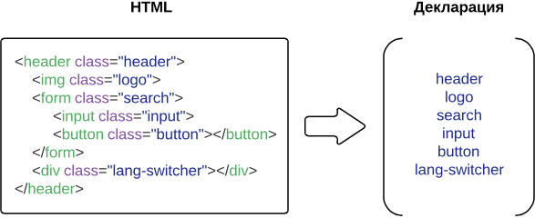

# Декларації в БЕМ

Щоб перерахувати БЕМ-суті, необхідні для побудови веб-сторінки (читай «приватного випадку [бандла](../build/build.ru.md#bundle)»), можна скористатися **декларацією**.

Декларація являє собою список [блоків](../key-concepts/key-concepts.ru.md#Блок), [елементів](../key-concepts/key-concepts.ru.md#Елемент) і [модифікаторів](../key-concepts/key-concepts.ru.md#Модифікатор), які використовуються на сторінці. Таким чином, інструмент збірки, грунтуючись на даних з декларації, обмежує кількість сутностей, що потрапляють в готовий проект. Немає необхідності підключати всі блоки проекту, якщо можна зібрати тільки потрібні за списком.

**Задача декларации** — определить, что и в каком порядке подключать в сборку.

>У БЕМ-платформі опис сторінки створюється у форматі BEMJSON, а декларація сторінки описується в форматі BEMDECL, наприклад:
```js
exports.blocks = [
    { name: 'input' },
    { name: 'button' },
    { name: 'checkbox' }
];
```

## Способи одержання декларації

Декларація може формуватися вручну. Для цього потрібно перерахувати БЕМ-сутності, що беруть участь в побудові сторінки.

Автоматична побудова декларації можливо:

* [по опису сторінки](#Створення декларації-опису сторінки)
* [з допомогою інтроспекції файлової системи](#Створення декларації з допомогою інтроспекції-файлової системи)

### Створення декларації за описом сторінки

Список необхідних для складання сутностей можна отримати за класами з HTML-файлу веб-сторінки.

У БЕМ-проекті структура веб-сторінки описується з допомогою [БЕМ-дерева](../key-concepts/key-concepts.ru.md#БЕМ-дерево). HTML-код сторінки містить класи з іменами всіх використовуваних блоків, елементів і модифікаторів. БЕМ-дерево може бути побудовано автоматично по класах з HTML або створено вручну.

При складанні сторінки декларація формується автоматично на підставі даних з БЕМ-дерева:
* Всі сутності (блоки, елементи і модифікатори) потрапляють до декларації у порядку, зазначеному в конфігурації збірки.
* Якщо на сторінці використовується одна і та ж сутність двічі, в декларацію вона потрапить тільки один раз.
* Вкладеність блоків і елементів в декларації не відображаються.

>Один з інструментів, що дозволяють отримати БЕМ-дерево з HTML-структурі сторінки, — [html2bemjson](https://github.com/bem-incubator/html2bemjson).



>Приклад проекту, в якому формується окрема декларація для кожної сторінки, — [Створюємо свій проект на БЕМ](https://ru.bem.info/tutorials/start-with-project-stub/).

### Створення декларації з допомогою інтроспекції файлової системи

Інше джерело, звідки можна зібрати дані про сутності — файлова система проекту.
Такий спосіб побудови декларації автоматично включає всі сутності, що знаходяться у файловій системі проекту. Це забезпечує стовідсоткове потрапляння в збірку всіх необхідних сутностей, але не надає точності: в збірку потраплять всі наявні сутності, а не лише потрібні.
Декларація, створена за описом сторінки, навпаки, забезпечує точкову збирання потрібних БЕМ-сутностей, але не може гарантувати підключення всіх сутностей, явно не описаних у файлі HTML сторінки.


>В [bem-components](https://ru.bem.info/libs/bem-components/) створення декларації з допомогою інтроспекції файлової системи використовується для поставки бібліотеки у вигляді [Dist](https://ru.bem.info/libs/bem-components/current/#Варианты-поставки-библиотеки).

## Алгебра декларацій

З допомогою декларацій можна керувати процесом збірки. Наприклад, можна об'єднувати декларації різних сторінок в одну і збирати весь проект цілком, а не посторінково. Декларації можна не тільки поєднувати, але і повторно використовувати, виділяти загальні частини або відмінності.

Таке управління дає можливість збирати всі сторінки в один [бандл](../build/build.ru.md#bundle), довантажувати необхідні частині сторінки на вимогу або повторно використовувати вже зібрані загальні компоненти на різних сторінках.

### Операції над деклараціями

* [додати](#Об'єднання кількох-декларацій-в-одну) — об'єднання множин сутностей різних декларацій в одну;
* [віднімання](#Одержання різниці між-деклараціями) — одержання різниці між множинами сутностей різних декларацій;
* [перетин](#Одержання декларації-на-основі-перетину кількох інших) — отримання декларації на підставі перетину множин сутностей двох інших декларацій.

#### Складання декларацій

Застосовується для створення загальних файлів технологій (наприклад, загального CSS і JavaScript-файл) для декількох сторінок. Використовується, якщо необхідно завантажити всі сторінки одночасно і не витрачати час на завантаження кожної окремої сторінки при переході між ними.

```text
Декларація 1            Декларація 2            Декларація 3

[                       [                       [
    'header',               'header',               'header',
    'input',                'input',                'input',
    'button',               'button',               'button',
    'link',                                         'link',
    'attach',     +                        =        'attach',
                            'menu',                 'menu',
                            'image',                'image',
    'checkbox',                                     'checkbox',
                            'popup'                 'popup',
    'textarea'                                      'textarea'
]                       ]                       ]
```

#### Віднімання декларацій

Один із способів застосування — збірка частині сторінки, яка догружается на вимогу (наприклад, у відповідь на дію користувача).

```text
Декларація 1            Декларація 2            Декларація 3

[                       [                       [
    'button',               'button',
    'checkbox',                                     'checkbox',
    'textarea',                                     'textarea',
    'suggest'                                       'suggest'
                            'header',
                    -       'input',       =
                            'button',
                            'menu',
                            'image',
                            'popup'
]                       ]                       ]
```

Наприклад, на сторінці використовується віртуальна клавіатура, яка стає доступною користувачеві тільки у відповідь на певну дію. Немає необхідності включати цей блок в збірку всієї сторінки, так як це збільшить час завантаження. Кнопки клавіатури можуть бути реалізовані на сторінці для інших цілей. Можливість віднімати декларації дозволяє створити окремий пакет (файли для частини сторінки) для відсутньої реалізації віртуальної клавіатури і підключати його тільки на вимогу.

#### Перетин декларацій

Застосовується для створення декларації, що описує загальні частини різних сторінок проекту. Це дозволяє зібрати загальну частину для всіх сторінок і підключати її при складанні один раз до всіх сторінок.

```text
Декларація 1            Декларація 2            Декларація 3

[                       [                       [
    'header',               'header',               'header',
    'input',                'menu',
    'link',        ⋂        'button',     =
    'attach',               'input',
    'checkbox',             'image',
    'textarea',             'popup',
    'footer'                'footer'                'footer'
]                        ]                       ]
```
Наприклад, такий поділ ефективно, якщо в проекті на всіх сторінках використовується `шапка` і `підвал`. Загальна частина сторінок описується в окремій декларації. При складанні кожна сторінка формується на підставі двох декларацій: загальної (містить `шапка` і `підвал`) і власної (яка описує частину сторінки).
